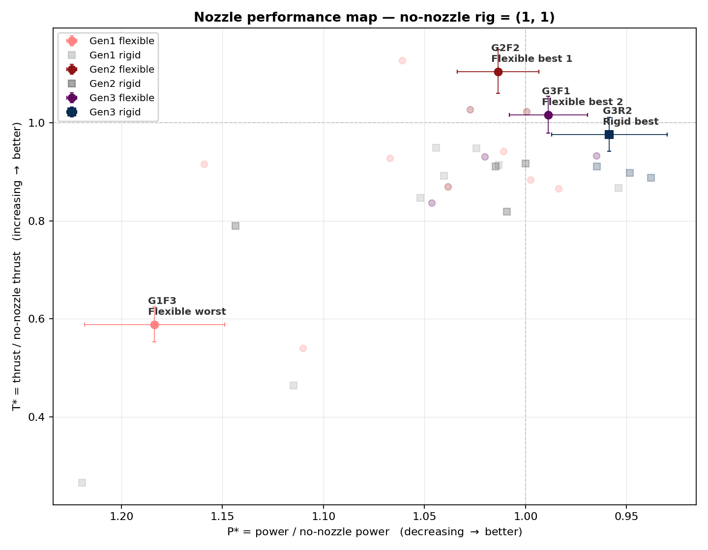
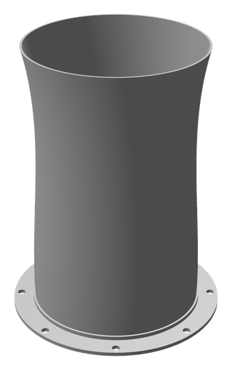
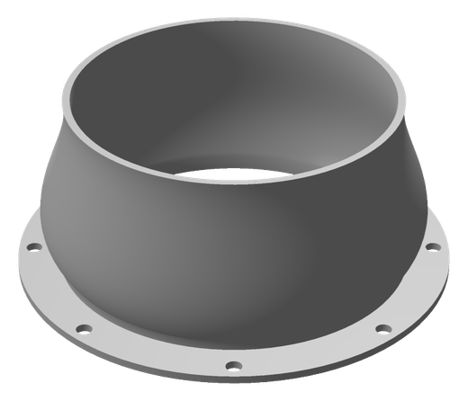
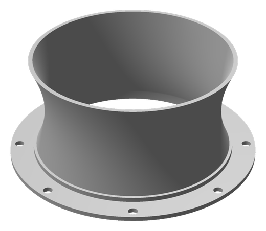
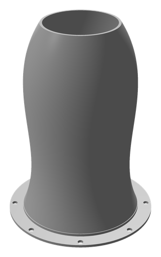

# Squid-Inspired Jet Nozzle Dataset

Thrust and power measurements for **32 propeller-driven jet nozzles** across three
design generations, together with the printable geometry of each one.

Generation 1 is a Latin-hypercube sweep of the design space. Generations 2 and 3
were proposed by a multi-objective Bayesian optimizer (ARD Matérn-5/2 GP + qEHVI)
trained on everything measured before them, maximizing thrust while minimizing
current draw.

Nozzles come in two materials, **rigid** and **flexible**. In Generation 1 each
shape was printed in both, so the same geometry appears twice. From Generation 2
on, rigid and flexible are optimized separately — each nozzle is one material
only, with its own geometry. All were measured on a dynamometer in a water tank.

The four representative shapes, with error bars over the three thrust pulses;
every other measured nozzle is behind them in faded form. Both axes are ratios
against the bare propeller, which sits at (1, 1). **Up and to the right is
better** — the power axis is reversed so that less power draw points right.
Indices for the faded points are in the results table below.

---

## Representative shapes

<table>
<tr>
<td width="25%" align="center"> <b>G2F2</b> Flexible best 1</td>
<td width="25%" align="center"> <b>G3F1</b> Flexible best 2</td>
<td width="25%" align="center"> <b>G3R2</b> Rigid best</td>
<td width="25%" align="center"> <b>G1F3</b> Flexible worst</td>
</tr>
</table>

| Index | Role | Generation | Material | T\* (thrust) | I\* = P\* (power) | STL |
|---|---|---|---|---|---|---|
| **`G2F2`** | Flexible best 1 | 2 | Flexible | **1.105** ± 0.044 | 1.014 ± 0.020 | [`G2_F_S2.stl`](STL/G2_F_S2.stl) |
| **`G3F1`** | Flexible best 2 | 3 | Flexible | **1.017** ± 0.038 | 0.989 ± 0.019 | [`G3_F_S1.stl`](STL/G3_F_S1.stl) |
| **`G3R2`** | Rigid best | 3 | Rigid | **0.977** ± 0.034 | 0.958 ± 0.029 | [`G3_R_S2.stl`](STL/G3_R_S2.stl) |
| **`G1F3`** | Flexible worst | 1 | Flexible | **0.588** ± 0.035 | 1.184 ± 0.035 | [`G1S3.stl`](STL/G1S3.stl) |

Their shape parameters:

| Index | bulge | neck | tip_expansion | R_tip (mm) | t_bottom (mm) | t_top (mm) | L (mm) |
|---|---|---|---|---|---|---|---|
| `G2F2` | 0.9743 | 0.936 | 0.9288 | 50.2222 | 0.9466 | 1.1814 | 139.7882 |
| `G3F1` | 1.1 | 1 | 0.9167 | 46.4392 | 2 | 2 | 42.5 |
| `G3R2` | 0.8463 | 0.9246 | 0.8258 | 55.25 | 0.7 | 2 | 42.5 |
| `G1F3` | 0.8455 | 0.9322 | 0.8378 | 33.9944 | 1.5733 | 1.8579 | 145.2361 |

---

## Reading the numbers

Both metrics are ratios against the **no-nozzle** rig running in the same session:

| | meaning | good direction | 1.0 means |
|---|---|---|---|
| **T\*** | thrust ÷ no-nozzle thrust | ↑ higher | same thrust as bare propeller |
| **I\*** | current ÷ no-nozzle current | ↓ lower | same current as bare propeller |
| **P\*** | power ÷ no-nozzle power | ↓ lower | supply voltage is fixed, so P\* = I\* exactly |

`± values` are the standard deviation over the three thrust pulses of a run, in
the same normalized units.

**Why normalize at all?** The rig's absolute output drifts between test sessions
by up to 20% — two Gen2 Rigid sessions measured the bare propeller at 26.9 N and
32.2 N. Yet the nozzle-to-baseline ratios in those two sessions were 0.865 and
0.853: the drift is in the rig, not in the nozzles. Dividing it out is what makes
generations comparable. Which no-nozzle run backs each session was chosen per
session by the experimenter, from the recorded data.

The consequence is that **T\* and I\* compare across the whole table, but raw
newtons would not** — which is why raw values are not published here. The
`Session` column records which no-nozzle run each row was divided by.

---

## Results

⭐ marks a representative shape. Sorted by T\* within each group.

**Gen1 Flexible**

| Index | T\* | I\* = P\* | Session | STL |
|---|---|---|---|---|
| `G1FCylinder` | 1.128 ± 0.037 | 1.061 ± 0.068 | G1 | — |
| `G1F6` | 0.943 ± 0.015 | 1.011 ± 0.087 | G1 | [`G1S6.stl`](STL/G1S6.stl) |
| `G1F2` | 0.928 ± 0.034 | 1.067 ± 0.052 | G1 | [`G1S2.stl`](STL/G1S2.stl) |
| `G1F1` | 0.917 ± 0.089 | 1.159 ± 0.153 | G1 | [`G1S1.stl`](STL/G1S1.stl) |
| `G1F8` | 0.884 ± 0.041 | 0.998 ± 0.041 | G1 | [`G1S8.stl`](STL/G1S8.stl) |
| `G1F5` | 0.866 ± 0.022 | 0.984 ± 0.030 | G1 | [`G1S5.stl`](STL/G1S5.stl) |
| `G1F3` ⭐ | 0.588 ± 0.035 | 1.184 ± 0.035 | G1 | [`G1S3.stl`](STL/G1S3.stl) |
| `G1F4` | 0.540 ± 0.011 | 1.110 ± 0.052 | G1 | [`G1S4.stl`](STL/G1S4.stl) |

**Gen1 Rigid**

| Index | T\* | I\* = P\* | Session | STL |
|---|---|---|---|---|
| `G1RCylinder` | 0.950 ± 0.018 | 1.044 ± 0.047 | G1 | — |
| `G1R2` | 0.948 ± 0.030 | 1.024 ± 0.040 | G1 | [`G1S2.stl`](STL/G1S2.stl) |
| `G1R5` | 0.914 ± 0.027 | 1.013 ± 0.051 | G1 | [`G1S5.stl`](STL/G1S5.stl) |
| `G1R8` | 0.892 ± 0.022 | 1.040 ± 0.047 | G1 | [`G1S8.stl`](STL/G1S8.stl) |
| `G1R6` | 0.867 ± 0.035 | 0.954 ± 0.046 | G1 | [`G1S6.stl`](STL/G1S6.stl) |
| `G1R1` | 0.847 ± 0.050 | 1.052 ± 0.072 | G1 | [`G1S1.stl`](STL/G1S1.stl) |
| `G1R4` | 0.463 ± 0.015 | 1.115 ± 0.017 | G1 | [`G1S4.stl`](STL/G1S4.stl) |
| `G1R3` | 0.265 ± 0.008 | 1.219 ± 0.057 | G1 | [`G1S3.stl`](STL/G1S3.stl) |

**Gen2 Flexible**

| Index | T\* | I\* = P\* | Session | STL |
|---|---|---|---|---|
| `G2F2` ⭐ | 1.105 ± 0.044 | 1.014 ± 0.020 | G2F | [`G2_F_S2.stl`](STL/G2_F_S2.stl) |
| `G2F1` | 1.028 ± 0.034 | 1.028 ± 0.011 | G2F | [`G2_F_S1.stl`](STL/G2_F_S1.stl) |
| `G2F3` | 1.023 ± 0.004 | 1.000 ± 0.052 | G2F | [`G2_F_S3.stl`](STL/G2_F_S3.stl) |
| `G2F4` | 0.870 ± 0.037 | 1.038 ± 0.033 | G2F | [`G2_F_S4.stl`](STL/G2_F_S4.stl) |

**Gen2 Rigid**

| Index | T\* | I\* = P\* | Session | STL |
|---|---|---|---|---|
| `G2R3` | 0.917 ± 0.037 | 1.000 ± 0.036 | G2R_S34 | [`G2_R_S3.stl`](STL/G2_R_S3.stl) |
| `G2R2` | 0.911 ± 0.022 | 1.015 ± 0.038 | G2R_S12 | [`G2_R_S2.stl`](STL/G2_R_S2.stl) |
| `G2R1` | 0.819 ± 0.013 | 1.009 ± 0.025 | G2R_S12 | [`G2_R_S1.stl`](STL/G2_R_S1.stl) |
| `G2R4` | 0.790 ± 0.038 | 1.143 ± 0.021 | G2R_S34 | [`G2_R_S4.stl`](STL/G2_R_S4.stl) |

**Gen3 Flexible**

| Index | T\* | I\* = P\* | Session | STL |
|---|---|---|---|---|
| `G3F1` ⭐ | 1.017 ± 0.038 | 0.989 ± 0.019 | G3F | [`G3_F_S1.stl`](STL/G3_F_S1.stl) |
| `G3F2` | 0.933 ± 0.018 | 0.965 ± 0.041 | G3F | [`G3_F_S2.stl`](STL/G3_F_S2.stl) |
| `G3F4` | 0.931 ± 0.023 | 1.020 ± 0.010 | G3F | [`G3_F_S4.stl`](STL/G3_F_S4.stl) |
| `G3F3` | 0.837 ± 0.031 | 1.046 ± 0.041 | G3F | [`G3_F_S3.stl`](STL/G3_F_S3.stl) |

**Gen3 Rigid**

| Index | T\* | I\* = P\* | Session | STL |
|---|---|---|---|---|
| `G3R2` ⭐ | 0.977 ± 0.034 | 0.958 ± 0.029 | G3R | [`G3_R_S2.stl`](STL/G3_R_S2.stl) |
| `G3R1` | 0.911 ± 0.029 | 0.965 ± 0.022 | G3R | [`G3_R_S1.stl`](STL/G3_R_S1.stl) |
| `G3R3` | 0.898 ± 0.036 | 0.948 ± 0.022 | G3R | [`G3_R_S3.stl`](STL/G3_R_S3.stl) |
| `G3R4` | 0.888 ± 0.014 | 0.938 ± 0.015 | G3R | [`G3_R_S4.stl`](STL/G3_R_S4.stl) |

---

## Files

| File | Content |
|---|---|
| [`nozzle_performance.csv`](nozzle_performance.csv) | 32 rows — the table above, machine-readable |
| [`geometry_parameters.csv`](geometry_parameters.csv) | 7 shape parameters per nozzle, same 32 rows, same `Index` |
| [`STL/`](STL) | 23 printable geometries |
| [`previews/`](previews) | Renders of the representative shapes |
| [`performance_map.png`](performance_map.png) | The plot at the top of this page |
| [`make_plot.py`](make_plot.py) | Script that regenerates the plot from the CSV |

### Columns

| Column | Meaning |
|---|---|
| `Index` | `G<generation><material><shape>` — e.g. `G1F3` is Generation 1, Flexible, shape 3. Joins the two CSVs 1:1 |
| `Generation` | 1–3 |
| `Type` | `R` rigid, `F` flexible |
| `Session` | Which no-nozzle run this row was normalized against; rows sharing a session are the most directly comparable |
| `T_star`, `I_star`, `P_star` | Normalized thrust, current, power (see above) |
| `*_std` | Standard deviation over the three pulses, normalized |
| `STL_File` | Geometry in `STL/` |
| `Representative` | Set for the four shapes highlighted above |

### Geometry parameters

| Parameter | Unit | Meaning |
|---|---|---|
| `bulge` | – | Mid-body radial expansion factor |
| `neck` | – | Throat contraction factor |
| `tip_expansion` | – | Outlet flare factor |
| `R_tip_mean_mm` | mm | Mean outlet radius |
| `t_bottom_mm`, `t_top_mm` | mm | Wall thickness at inlet / outlet |
| `L_mm` | mm | Nozzle length |

All nozzles share a fixed mounting interface: 85 mm inner bore, 110 mm flange,
2 mm flange thickness, 8 × ⌀4 mm bolts on a 51 mm circle.

---

## Notes

- **Only Generation 1 shares geometry between materials.** `G1R3` and `G1F3` are
  the same printed shape in different material, so they carry identical parameter
  rows and point at the same STL. Generation 2 and 3 nozzles are each a single
  material with geometry of their own — `G2F1` and `G2R1` are unrelated shapes.
  The optimizer runs one GP per material, trained only on that material's data.
- **`Cylinder`** is a plain reference tube, not an optimizer output, and has no
  STL. In flexible material it out-thrusts every shaped Generation 1 nozzle
  (T\* = 1.127) — worth knowing before reading too much into the early sweep.
- **Shape 7** of the Generation 1 sweep was never tested, so the indices skip
  from 6 to 8.
- **32 rows are 32 physical nozzles but only 24 distinct geometries.** Each
  Generation 1 shape was printed in both materials, so its 8 shapes account for
  16 rows. Generation 2 and 3 contribute 8 rows and 8 geometries each.
- **Generation 3 Rigid** numbers come from a 2026-05-06 processing run whose raw
  dynamometer files are no longer in the source project, so they cannot currently
  be recomputed from scratch.

## License

Measurement data and geometry from a DARPA-funded study of squid-inspired
propulsion. Please contact the repository owner before reuse.
